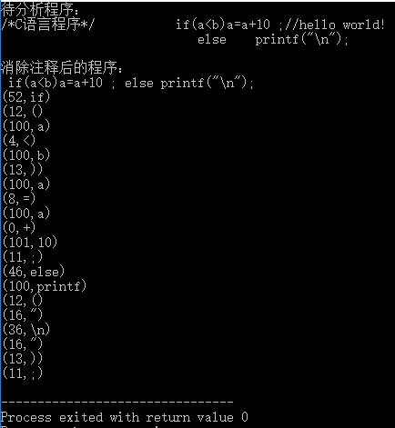
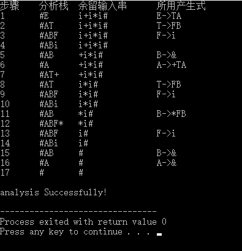

# 编译原理课程实验
# 1 项目简介

### 1.1 系统介绍
&emsp;&emsp;编译原理在源程序原型之前需要对其完成词法分析、语法分析、中间代码生成、代码优化和目标代码生成5个部分工作。该实验通过设计词法分析器和LL(1)语法分析器来实现其中的词法分析和语法分析部分功能。

### 1.2 实现思路

#### 1.2.1 词法分析器：

##### (1)首先将语言的关键字、运算符和界限符存储起来并为其编号。
##### (2)词法分析器读取要分析的程序代码，识别并消除代码中的注释部分。
##### (3)对消除注释的代码进行词法分析，分别识别其中的关键字、运算符、界限符、标识符和常量并输出其在系统中的编号（标识符编号为100，常量为101）。

#### 1.2.2 LL(1)语法分析器：

##### (1)首先将检验文法是否存在左递归，如果属于左递归文法则消除其中的递归部分使其变成非递归文法。
##### (2)读入待分析文法产生式，计算非终结符的First、Follow和Select集合。
##### (3)依据Select集合构造LL(1)语法分析表，最后依据分析表对所给句子进行语法分析。

# 2 程序运行结果图

### 2.1词法分析器

   <h5>图1 词法分析器程序运行结果图</h5>

### 2.2 LL(1)语法分析器

   <h5>图2 LL(1)语法分析器程序运行结果图</h5>

